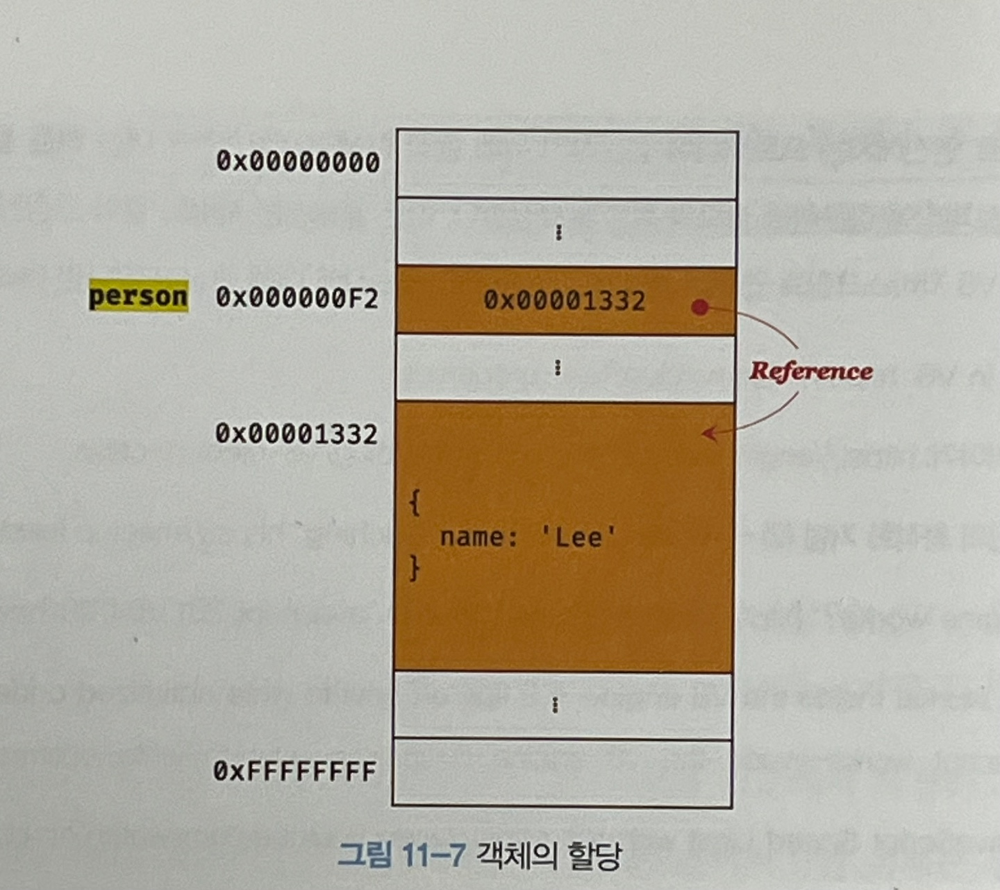

# 11. 원시 값과 객체 비교

자바스크립트는 원시 타입과 객체 타입으로 구분
||원시 타입|객체 타입|
|:--|:--|:--|
|변경 가능성|X|O|
|변수에 할당 값|실제 값|참조 값|
|변수를 다른 변수에 할당하여 복사된 값|값에 의한 전달|참조에 의한 전달|

## 1. 원시 값

### 1.1 변경 불가능한 값

- 원시 타입 값은 변경 불가능한 값 (**변경 불가능하다는 것은 변수가 아니라 값에 대한 진술이며 변수는 재할당을 통해 변수 값을 교체할 수 있음**)
- 원시 값을 할당한 변수에 새로운 원시 값을 **_재할당_**하면 새로운 메모리 공간을 확보하고 재할당한 원시 값을 저장한 후, 변수는 새롭게 재할당한 원시 값을 가리킴

  이때 변수가 참조하던 메모리 공간의 주소가 바뀜 (변수에 할당된 원시 값이 변경 불가능한 값이기 때문)

### 1.2 문자열과 불변성

1\) 문자열
원시 값을 저장하려면 먼저 확보해야 하는 메모리 공간의 크기를 결정해야 함

ECMAScript 사양에 `문자열 타입(2바이트)`, `숫자 타입(8바이트)`의 크기를 명확하게 규정

_문자열_ 0개 이상의 문자로 이뤄진 집합이며 1개의 문자는 2바이트의 메모리 공간에 저장됨

**_숫자 값은 1도, 1000000도 동일한 8바이트가 필요하지만 문자열의 경우 1개의 문자로 이뤄진 문자열은 2바이트 (10개의 문자는 20바이트가 필요)_**

    cf\) C에는 char 문자열을 문자의 배열로 처리, 자바에서는 문자열을 String 객체로 처리

2\) 불변성

재할당 가능

```js
//  'Hello'와 'world' 모두 메모리 존재
//  식별자 str가 가르키는 문자열이 다른 것 (값이 바뀐 것이 아님)
var str = "Hello";
str = "world";
```

**문자열은 윤사 배열 객체이며 이터러블이므로 배열과 유사하게 각 문자에 접근할 수 있음** + for 문으로 순회할 수도 있음 (원시 값을 _객체처럼_ 사용하면 원시 값을 감싸는 래퍼 객체로 자동 변환)

```js
// 인덱스를 사용해 각 문자에 접근 가능
var str = "string";

console.log(str[0]); //  s

//  문자열은 원시 값이므로 변경할  수 없음
str[0] = "S";

console.log(str); // string
```

### 1.3 값에 의한 전달

```js
var score = 80;
var copy = score; // -> (1)

score = 100;

console.log(score); // 100
console.log(copy); // 80
```

- 변수에 원시 값을 갖는 변수를 할당하면 할당받는 변수(copy)에서 할당되는 변수(score)의 원시 값이 복사되어 전달됨 → **값에 의한 전달**
- 코드 속 `(1)`을 보면 score 변수와 copy 변수의 값은 80은 다른 메모리 공간에 저장된 별개의 값임 → score 변수의 값을 변경해도 copy 변수의 값에는 어떠한 영향도 주지 않음

- 값에 의한 전달: 엄격하게 표현하면 변수에는 값이 전달되는 것이 아니라 메모리 주소가 전달됨 </br> 이는 변수와 같은 식별자는 값이 아니라 **\*메모리 주소를 기억하고 있음**

  ```js
  var copy = score;
  ```

  1\) 새로운 80을 생성(복사)해서 메모리 주소를 전달하는 방식. 이 방식은 할당 시점에 두 변수가 기억하는 메모리 주소가 다름

  2\) score 변수값 80의 메모리 주소를 그대로 전달하는 방식. 이 방식은 할당 시점에 두 변수가 기억하는 메모리 주소가 같음

  3\) 결국은 두 변수의 원시 값은 서로 다른 메모리 공간에 저장된 별개의 값이 되어 어느 한쪽에서 재할당을 통해 값을 변경하더라도 서로 간섭할 수 없음

## 2. 객체

- 프로퍼티의 개수가 정해져 있지 않음
- 동적으로 추가되고 삭제할 수 있음
- 프로퍼티 값에도 제약이 없어 객체는 원시 값과 깉이 확보해야 할 메모리 공간의 크기를 사전해 정해 둘 수 없음

**자바스크립트의 객체의 관리 방식**

- 프로퍼티 키를 인덱스로 사용하는 해시테이블보다 더 나은 방법으로 객체를 구현
- 클래스 없이 객체를 생성할 수 있으며 객체가 생성된 이후라도 동적으로 프로퍼티와 메서드를 추가할 수 있음
- 클래스 기반 객체지향 프로그래밍 언어의 객체보다 생성과 프로퍼티 접근에 비용이 더 많이 드는 비효율적인 방식
- 프로퍼티에 접근하기 위해 동적 탐색 대신 히든 클래스라는 방식을 사용

### 2.1 변경 가능한 값

- 객체(참조) 타입의 값, 즉 객체는 변경 가능한 값임
- 객체를 할당한 변수가 기억하는 메모리 주소를 통해 메모리 공간에 접근하면 **참조 값**에 접근할 수 있음
- 참조 값은 생성된 객체가 저장된 메모리 공간의 주소, 그 자체

  

  > person 변수는 객체 {name: 'Lee'}를 가리키고(참조하고)있다.

- **재할당 없이 객체를 직접 변경할 수 있음**(프로퍼티를 동적으로 추가할 수도 있고 프로퍼티 값을 갱신할 수도 있으며 프로퍼티 자체를 삭제할 수도 있음)

  ```js
  var person = {
    name: "Lee",
  };

  //  프로퍼티 값 갱신
  person.name = "Kim";

  //  프로퍼티 동적 생성
  person.address = "Seoul";
  ```

  > 메모리에 저장된 객체를 직접 수정할 수 있음
  > 이때 객체를 할당한 변수에 재할당을 하지 않았으므로 객체를 할당한 변수의 참조 값은 변경되지 않음

- **_부작용으로 여러 개의 식별자가 하나의 객체를 공유할 수 있음_**

### 2.2. 참조에 의한 전달

```js
var person = {
  name: "Lee",
};

// 참조 값을 복사(얕은 복사)
var copy = person;
```
참조에 의한 전달: 객체를 가리키는 변수(원본, person)를 다른 변수(사본, copy)에 할당하면 원본의 참조 값이 복사되어 전달됨

위 예제 코드는 저장된 메모리 주소는 다르지만 동일한 참조 값은 갖음(동일한 객체를 가리킴)

**이것이 두 개의 식별자가 하나의 객체를 공유**한다는 것

원본 또는 사본 중 한쪽에서 객체를 변경하면 서로 영향을 주고받음

자바스크립트에는 "참조에 의한 전달"은 존재하지 않고 "값에 의한 전달"만이 존재한다고 말할 수 있음

| 용어           | 설명                                                                            |
| :------------- | :------------------------------------------------------------------------------ |
| 유사 배열 객체 | 배열처럼 인덴스 프로퍼티 값에 접근할 수 있고 length 프로퍼티를 갖는 객체를 말함 |
| 얕은 복사      | 객체를 프로퍼티 값으로 갖는 객체의 경우 한 단계까지만 복사하는 것               |
| 깊은 복사      | 객체에 중첩되어 있는 객체까지 모두 복사하는 것                                  |
