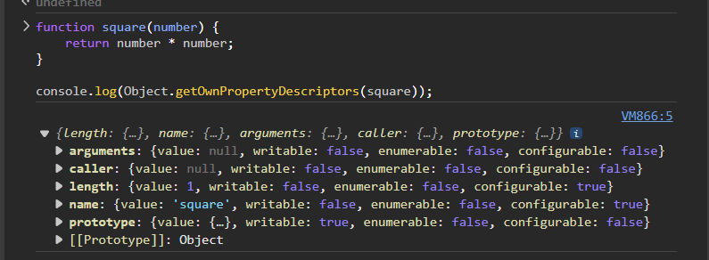

# 18. 함수와 일급 객체

## 18.1 일급 객체

일급 객체

1. 무명의 리터럴로 생성할 수 있다. 즉, 런타임에 생성이 가능하다.
2. 변수나 자료구조(객체, 배열 등)에 저장할 수 있다.
3. 함수의 매개변수에 전달할 수 있다.
4. 함수의 반환값으로 사용할 수 있다.

```js
const increase = function (num) {
  return ++num;
};

const auxs = { increase }; // 몇 가지 함수 생략

function makeCounter(aux) {
  let num = 0;

  return function () {
    num = aux(num);
    return num;
  };
}

const increaser = makeCounter(aux.increase);
console.log(increaser()); // 1
console.log(increaser()); // 2
```

> 함수가 일급 객체라는 것은 함수를 개체와 동일하게 사용할 수 있다는 의미

## 18.2 함수 객체의 프로퍼티

함수 객체의 데이터 프로퍼티 `arguments`, `caller`, `length`, `name`, `prototype`



### 18.2.1 arguments 프로퍼티

arguments 객체란?

- 함수 객체의 arguments 프로퍼티 값은 arguments 객체임
- arguments 객체는 함수 호출 시 전달된 인수들의 정보를 담고 있는 순회 가능한 유사 배열 객체임
- 함수 외부에서는 참조할 수 없음

arguments 객체 분석

- arguments 객체는 인수를 프로퍼티 값으로 소유하며 프로퍼티 키는 인수의 순서를 나타냄
- arguments 객체의 callee 프로퍼티는 호출되어 함수 자신을 가리킴
- arguments 객체의 length 프로퍼티는 인수의 개수를 가리킴
- arguments 객체의 Symbol(Symbol.iterator) 프로퍼티는 arguments 객체를 순회 가능한 자료구조인 이터러블로 만들기 위한 프로퍼티임

> arguments 객체는 매개변수 개수를 확정할 수 없는 가변 인자 함수를 구현할 때 유용

### 18.2.2 caller 프로퍼티

ECMAScript 사양에 포함되지 않은 비표준 프로퍼티임

### 18.2.3 length 프로퍼티

함수 객체의 length 프로퍼티는 매개 변수의 개수를 가리킴

arguments의 length 프로퍼티는 인자의 개수를 가리킴

### 18.2.4 name 프로퍼티

함수 객체의 name 프로퍼티는 함수 이름을 나타냄

```js
// 기명 함수 표현식
var namedFunc = function foo() {};
console.log(namedFunc.name); // foo
```

> 함수 이름과 함수 객체를 가리키는 식별자는 의미가 다름
>
> 함수를 호출할 때는 함수 이름이 아닌 함수 객체를 가리키는 식별자로 호출함

### 18.2.5 `__proto__` 접근자 프로퍼티

모든 객체는 [[Prototype]]이라는 내부 슬롯을 갖음

객체지향 프로그래밍의 상속을 구현하는 프로토타입 객체를 가리킴

`__proto__`프로퍼티는 [[Prototype]] 내부 슬롯이 가리키는 프로토타입 객체에 접근하기 위해 사용하는 접근자 프로퍼티임

> [[Pototype]] 내부 슬롯은 직접 접근할 수 없음

### 18.2.6 prototype 프로퍼티

생성자 함수로 호출할 수 있는 함수 객체

constructor만이 소유하는 프로퍼티임
