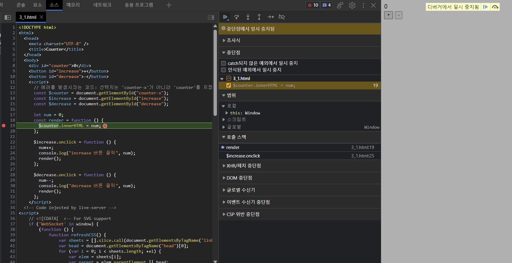

# 03 자바스크립트 개발 환경과 실행 방법

## 1. 자바스크립트 실행 환경
모든 브라우저와 Node.js는 자바스크립트를 해석하고 실행할 수 있는 자바스크립트 엔진을 내장함

브라우저는 브라우저 화면에 렌더링이 주된 목적이고, Node.js는 브라우저 외부에서 자바스크립트 실행 환경을 제공하는 것이 주된 목적임

브라우저는 클라이언트 사이드 Web API를 지원하고, Node.js는 클라이언트 사이드 Web API를 지원하지 않고 Node.js고유의 API를 지원 (둘다 ECMAScript 지원)

자바스크립트 개발 환경을 구축하고 자바스크립트를 실행하는 방법
- 브라우저 환경
- Node.js 환경
- **코드 에디터인 비주얼 스튜디오 코드**를 사용해 브라우저나 Nod.js 환경에서 실행하는 방법
  
## 2. 웹 브라우저 (교재에서는 구글 크롬 브라우저 사용)

### 1) 개발자 도구
개발자 도구 실행 단축키 
- 윈도우 : F12 + Ctrl + Shift + I
- macOS : command + option + I
  
개발자 도구의 기능, 패널
- Elements: (로딩된 웹페이지의) DOM과 CSS를 편집해서 렌더링된 뷰를 확인 (편집된 내용 저장 X)
- Console: (...)에러 확인, 자바스크립트 소스코드에 작성한 console.log 메서드의 실행 결과 확인
- Sources: (...)디버깅
- Netwokr: (...)네트워크 요청정보와 성능 확인
- Application: 웹 스토리지, 세션, 쿠기를 확인하고 관리
### 2) 콘솔
코드에서 에러가 발생해 애플리케이션이 정상적으로 동작하지 않을 때 가장 우선적으로 살펴봐야 할 곳

코드의 실행 결과 확인
```js
console.log(...) // 소괄호 안의 코드를 평가해서 그 결과를 콘솔에 출력하는 함수
```
(개발자 도구 콘솔에서 자바스크립트 코드를 실행할 때 줄바꿈 하는 법: Shift + Enter)
### 3) 브라우저에서 자바스크립트 실행 
(나는 Visual Studio Code 에서 .html 파일 만들었음.)
### 4) 디버깅
Sources 패널에서 디버깅
1. 에러가 발생한 코드 왼쪽의 라인 번호(19)를 클릭해 브레이크포인트(중단점)를 걸음
2. 다시 버튼을 클릭 
   -> 디버깅 모드
   
예시

-> 19번째 줄의 $counter에 마우스 커서를 올려 보면 null 에러 확인

## 3. Node.js
### 1) Node.js와 npm 소개
- Node.js: 자바스크립트를<span style = "color: red">브라우저 이외의 환경</span>에서 동작시킬 수 있는 자바스크립트 실행 환경
- npm(node package manager): 자바스크립트 패키지 매니저,<span style = "color: red">Node.js에서 사용할 수 있는 모듈들을 패키지화해서 모아둔 저장소 역할과 패키지 설치 및 관리를 위한 CLI를 제공</span>
  
예시 (패키지 설치)

Node.js에서 사용할 수 있는 모듈인 패키지를 설치할 때에는 npm install 명령어 뒤에 설치할 패키지 이름을 지정
```bash
$ npm install <package>
```

### Node.js 설치
http://nodejs.org , LTS( 안정된 지원 보장),  Current (최신 기능 제공)

### Node.js REPL
터미널(윈도우에서는 명령 프롬프트)에서 자바스크립트 코드 실행해 결과 확인 가능

## 4. 비주얼 스튜디오 코드
브라우저의 콘솔 또는 Node.js의 REPL 한계점: 애플리케이션을 개발하는 단계에서 부족함

<span style = "color: red"> 코드 에디터(VS Code)</span>의 장점: **코드 자동 완성**, **문법 오류 감지**, **디버깅**, **Git 연동**

VS Code에서는 확장 플러그인 저장소인 "마켓플레이스"를 통해 다양한 확장 플로그인을 다운로드해서 설치할 수 있다. ex) Code Runner, Live Server 