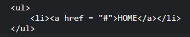

# 06 데이터 타입

데이터 타입: 값의 종류
- 원시 타입: 숫자 타입, 문자열 타입, 불리언 타입, undefined 타입, null 타입, 심벌 타입
- 객체 타입: 객체, 함수, 배열 등 

## 1. 숫자 타입

**숫자 타입**은 자바스크립트는 하나의 숫자 타입만 존재함

숫자 타입의 값은 배밀정도 64비트 부동소수점 형식을 따름 - 모든 수를 실수로 처리함

정수, 실수, 2진수, 8진수, 16진수 리터럴은 모두 메모리에 배정밀도 64비트 부동소수점 형식의 2진수로 **저장**, 2진수, 8진수, 16진수를 표현하기 위한 데이터 타입을 제공하지 않기 때문에 이들 값을 참조하면 모두 10진수로 **해석**
```js
// 예제 06-02
var  binary = 0b01000001; // 2진수
var octal = 0o101;        // 8진수

console.log(binary);     //65
console.log(octal);      //65

console.log(binary == octal); //true
```
정수만을 위한 타입이 없고 모든 수를 실수로 처리하기 때문에 정수로 표시되는 수끼리 나누더라도 실수가 나올 수 있음
```js
// 예제 06-03
// 숫자 타입은 모두 실수로 처리된다.
console.log(1 == 1.0); //true
console.log(3 / 2);    //1.5
```

숫자 타입의 특별한 값
- Infinity: 양의 무한대
- -Infinity: 음의 무한대
- NaN: 산술 연산 불가(not-a-number)

## 2. 문자열 타입

**문자열 타입**은 텍스트 데이터를 나타내는 데 사용

`작은따옴표('')`, `큰따옴표("")`, `백틱(``) `으로 텍스트를 감쌈

다른 타입의 값과 달리 문자열을 따옴표로 감싸는 이유는 키워드나 식별자 같은 토큰과 구분하기 위해
```js
// 예제 06-07
// 따옴표로 감싸지 않은 hello를 시별자로 인식한다.
var string = hello; // ReferenceError: hello is not defined
```

## 3. 템플릿 리터럴

**템플릿 리터럴**은 런타임에 일반 문자열로 변환되어 처리됨

일반 문자열과 다르게 ` 백틱(``) `만을 사용해 표현

<span style = "color: red">문자열 처리 기능</span>
- 멀티라인 문자열
  


일반 문자열 - 일반 문자열 내에서 줄바꿈 등의 공백을 표현하려면 백슬래시(\)로 시작하는 이스케이프 시퀀스를 사용해야 함
```js
var template = '<ul>\n\t<li><a href = "#">HOME</a></li>\n</ul>';
console.log(template);
```
템플릿 리터럴
```js
var template = `<ul>
    <li><a href = "#">HOME</a></li>
</ul>`;
console.log(template);
```
- 표현식 삽입
일반 문자열 - 문자열 연산자 + 를 사용해 연결
```js
// 예제 06-12
var first = 'Ung-mo';
var last = 'Lee';

console.log('My name is ' + first + ' ' + last + '.'); // My name is Ung-mo Lee.
```
탬플릿 리터럴 - 표현식을 사입하려면 `${}`으로 표현식을 감쌈

```js
// 변수 선언과 초기화 생략
console.log(`My name is ${first} ${last}.`); // My name is Ung-mo Lee.
```
## 4. 불리언 타입

**불리언 타입**의 값은 논리적 참, 거짓을 나타내는 true와 false뿐임

프로그램의 흐름을 제어하는 조건문에서 자주 사용

## 5. undefined 타입

**undefined 타입**의 값은 undefined가 유일함

var 키워드로 선언한 변수는 암묵적으로 undefined로 초기화(그러지 않으면 메모리 값에 쓰레기 값이 할당 되어있음)

<span style = "background: blue">자바스크립트 엔진이 변수를 초기화하는 데 사용하는 undefined를 개발자가 의도적으로 변수에 할당한다면 본래 취지와 어긋나 권장하지 않음</span> 

변수에 값이 없다는 것을 명시하고 싶을 땐 **null** 할당

## 6. null 타입

**null 타입**의 값은 null이 유일

null은 변수에 값이 없다는 것을 의도적으로 명시할 때 사용

함수가 유효한 값을 반환할 수 없는 경우 명시적으로 null을 반환하기도 함

## 7. 심벌 타입

**심벌 타입**은 변경 불가능한 원시 타입의 값

주로 이름이 충돌할 위험이 없는 객체의 유일한 프로퍼티 키를 만들기 위해 사용

심벌 이외의 원시 값은 리터럴을 통해 생성하지만 심벌은 Symbol 함수를 호출해 생성
```js
var key = Symbol('key');

// 객체 생성
var obj = {};

// 이름이 충돌할 위험이 없는 유일무이한 값인 심벌을 프로퍼티 키로 사용
obj[key] = 'value';
console.log(obj[key]); // value
```

- 외부에 노출되지 않음
- 다른 값과 절대 중복되지 않는 유일무이한 값

## 8. 객체 타입

자바스크립트는 객체 기반의 언어이며, 자바스크립트를 이루고 있는 거의 모든 것이 객체라는 것

## 9. 데이터 타입의 필요성
- 값을 저장할 때 확보해야 하는 메모리 공간의 크기를 결정하기 위해
  
  변수에 할당되는 값의 데이터 타입에 따라 확보해야 할 메모리 공간의 크기 결정

- 값을 참조할 때 한 번에 읽어 들여야 할 메모리 공간의 크기를 결정하기 위해
- 메모리에서 읽어 들인 2진수를 어떻게 해석할지 결정하기 위해

## 10. 동적 타이핑

**정적 타입 언어**: 변수의 타입을 변경할 수 없으며, 변수에 선언한 타입에 맞는 값만 할당할 수 있음 (C, C++, 자바, 코틀린 등)


특징) 일관성을 강제함으로써 더욱 안정적인 코드의 구현을 통해 런타임에 발생하는 에러를 줄임 

**동적 타입 언어**: 할당에 의해 타입이 결정되며 재할당에 의해 변수 타입은 언제든지 동적으로 변할 수 있는 동적 타이핑임 (<span style = "background: orange">자바스크립트 </span>, 파이썬, PHP 등)

동적 타입 언어의 구조적인 단점

1) 복잡한 프로그램에서는 변화하는 변수 값을 추적하기 어려울 수 있음
2) 동적 타입 언어의 변수는 값을 확인하기 전에는 타입을 확신할 수 없음
3) 자바스크립트는 개발자의 의도와는 상관없이 자바스크립트 엔진에 의해 암묵적으로 타입이 자동적으로 변환되기도 함

변수 사용할 때 주의 사항

1) 변수는 꼭 필요한 경우에 한해 제한적으로 사용
2) 변수의 유효 범위(스코프)는 최대한 좁게 만들어 변수의 부작용을 억제해야 함
3) 전역 변수는 최대한 사용하지 않도록 해야 함
4) 변수보다는 상수를 사용해 값의 변경을 억제해야 함
5) 변수 이름뿐만 아니라 모든 식별자(변수, 함수, 클래스 이름 등)는 존재 이유를 파악할 수 있도록 네이밍해야 함